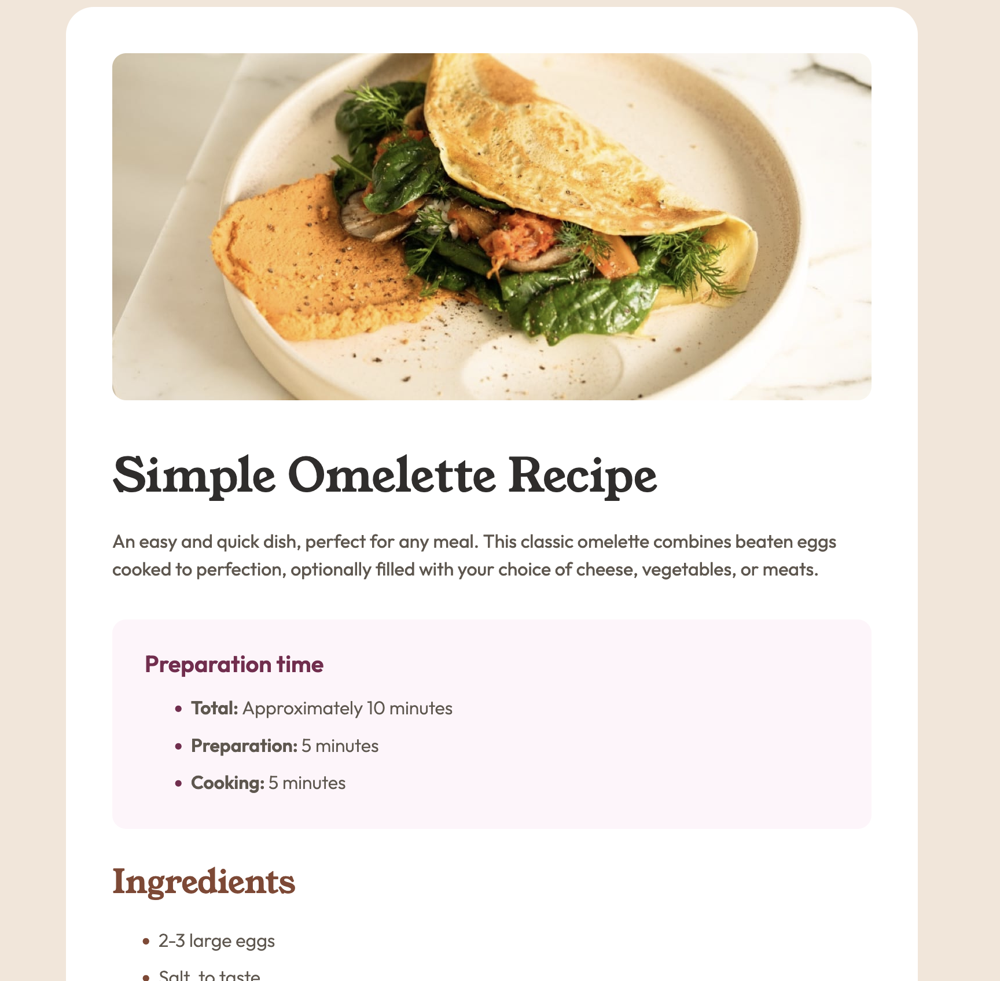

# Frontend Mentor - Recipe page solution

This is a solution to the [Recipe page challenge on Frontend Mentor](https://www.frontendmentor.io/challenges/recipe-page-KiTsR8QQKm). Frontend Mentor challenges help you improve your coding skills by building realistic projects.

## Table of contents

- [Overview](#overview)
  - [The challenge](#the-challenge)
  - [Screenshot](#screenshot)
  - [Links](#links)
- [My process](#my-process)
  - [Built with](#built-with)
  - [What I learned](#what-i-learned)
- [Acknowledgments](#acknowledgments)

**Note: Delete this note and update the table of contents based on what sections you keep.**

## Overview

### The challenge

Users should be able to:

- See hover and focus states for all interactive elements on the page.

### Screenshot

### Links

- Solution URL: [Add solution URL here](https://your-solution-url.com)
- Live Site URL: [Add live site URL here](https://your-live-site-url.com)

## My process

### Built with

- Semantic HTML5 markup
- CSS custom properties
- Flexbox

### What I learned

First of all, I learnt that I am really bad at estimating!
I estimated I needed 200 minutes for this challenge, but I needed the double to polish everything… and I learnt it takes **very** long to do so

To stick to the design was particularly challenging. I made the conscious choice to deviate from the design regarding the bullets, because the solutions I found were hurting accessibility.

The nutrition table at the bottom was challenging and there were many ways I could approach it. I chose multiple divs over use of table. It worked but I am not sure that was the best solution.

## Acknowledgments

Thanks to @dakirzakaria I was incentivised to use better html semantics. Thank you.
